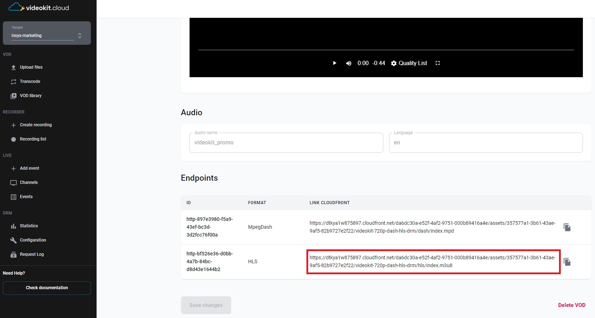
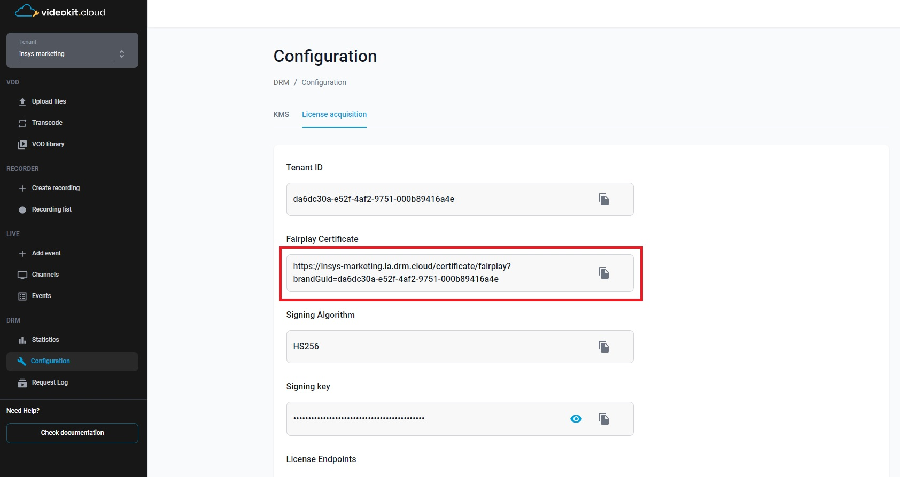
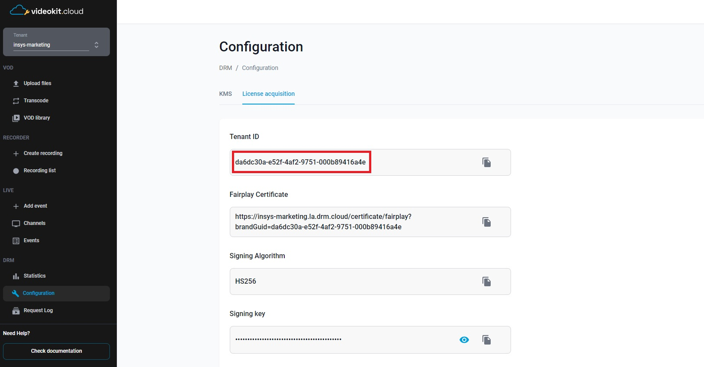

# AVPlayer with Cloud DRM in Swift

The Swift code presents the implementation of the `PlayerViewController` class, which inherits from `AVPlayerViewController` and implements the `AVContentKeySessionDelegate` protocol. This class is responsible for playing videos using the FairPlay Streaming DRM system.

## Prerequisites

  - XCode installed
  - Knowledge of Swift programming language
  - Access to Cloud DRM (via Cloud Video Kit web console) to obtain: 
    - `videoUrl` - The url to the HLS manifest of the video
    

    - `fpsCertificateUrl` - Certificate server url
    

    - `x-drm-brandGuid` - Tenant ID in the Cloud Video Kit
    
    
    - `x-drm-userToken` - A token that allows you to issue a license to play drm material. <br>[More information about the structure of the token and how to generate it can be found here](https://developers.drm.cloud/licence-acquisition/licence-acquisition)
    
    ```json
    {
        "exp": 1893456000, 
        "drmTokenInfo": {
            "exp": "2030-01-01T00:00:00+00:00", 
            "kid": ["c7962562-1517-44c2-8937-a1f2c6b849fc"], 
            "p": { 
            "pers": false 
            }
        }
    }
    ```

## How to Use
To use `PlayerViewController`, follow these steps:

1. Create an instance of `PlayerViewController` and assign appropriate values to the properties:
    - `videoUrl`: URL of the video to be played.
    - `fpsCertificateUrl`: URL of the FairPlay Streaming certificate.
    - `brandGuid`: VideoKit TenantId.
    - `userToken`: DRM token.
2. Call the `viewDidLoad()` method on the `PlayerViewController` instance to configure the Content Key session and prepare and start video playback.

## Description

```swift
import AVKit
import SwiftUI

class PlayerViewController: AVPlayerViewController, AVContentKeySessionDelegate {

    // URL for the video to be played
    let videoUrl: String = ""
    
    // URL for the FairPlay Streaming certificate
    let fpsCertificateUrl: String = ""
    
    // VideoKit TenantId 
    let brandGuid: String = ""
    
    // DRM token
    let userToken: String = ""
    
    // AVContentKeySession for handling content key requests
    var contentKeySession: AVContentKeySession!
    
    // URLSession for network requests
    let urlSession: URLSession = URLSession(configuration: .default)
    
    // ...
    // some code
    // ...
}
```
The `PlayerViewController` class inherits from `AVPlayerViewController` and extends it to support FairPlay Streaming DRM. It includes the following methods and properties:

- `videoUrl`: URL of the video to be played.
- `fpsCertificateUrl`: URL of the FairPlay Streaming certificate.
- `brandGuid`: VideoKit TenantId.
- `userToken`: DRM token.
- `contentKeySession`: AVContentKeySession instance for handling content key requests.
- `urlSession`: URLSession instance for network requests.

The `viewDidLoad()` method overrides the `AVPlayerViewController` method and is used for configuring the Content Key session and preparing and starting video playback.

```swift
// Set up the AVContentKeySession for handling content key requests
private func setupContentKeySession() {
    // Create the Content Key Session using the FairPlay Streaming key system.
    contentKeySession = AVContentKeySession(keySystem: .fairPlayStreaming)
    
    /*
    Set PlayerViewController as the delegate of the Content Key Session.
    The delegate methods will be called when the session needs to handle key requests.
    Use a dedicated queue for delegate callbacks.
    */
    contentKeySession.setDelegate(self, queue: DispatchQueue(label: "\(Bundle.main.bundleIdentifier!).ContentKeyDelegateQueue"))
}
```

The `setupContentKeySession()` method creates an `AVContentKeySession` using the FairPlay Streaming key system. It also sets the `PlayerViewController` as the delegate of the session to handle key requests.

```swift
// Create the Content Key Session using the FairPlay Streaming key system
private func prepareAndPlay() {
    // Create a URL instance from the video URL string.
    guard let assetUrl: URL = URL(string: self.videoUrl) else {
        return
    }
    
    /*
    Initialize an AVURLAsset with the asset URL.
    AVURLAsset represents the media resource that will be played.
    */
    let asset: AVURLAsset = AVURLAsset(url: assetUrl)
    
    /*
    Associate the AVURLAsset with the Content Key Session.
    The Content Key Session will handle key requests for this asset.
    */
    contentKeySession.addContentKeyRecipient(asset)
    
    /*
    Initialize an AVPlayerItem with the AVURLAsset.
    AVPlayerItem represents a single media item that can be played by AVPlayer.
    */
    let playerItem: AVPlayerItem = AVPlayerItem(asset: asset)
    
    /*
    Initialize an AVPlayer with the AVPlayerItem.
    AVPlayer handles the playback of the media content.
    */
    let player: AVPlayer = AVPlayer(playerItem: playerItem)
    
    /*
    Set the AVPlayer instance as a reference to the PlayerViewController.
    The PlayerViewController will manage the display and control of the player.
    */
    self.player = player
    
    // Start playback.
    player.play()
}
```

The `prepareAndPlay()` method prepares and starts video playback. It creates an `AVURLAsset` instance based on the video URL, adds the asset to the Content Key session, creates `AVPlayerItem` and `AVPlayer` instances to represent the item to be played and handle playback, sets the `AVPlayer` as a reference in `PlayerViewController`, and starts playback.

```swift
/*
 This delegate callback is called when the client initiates a key request.
 It is also triggered when AVFoundation determines that the content is encrypted based on the playlist provided by the client during playback request.
*/
func contentKeySession(_ session: AVContentKeySession, didProvide keyRequest: AVContentKeyRequest) {
    // Extract content identifier and license service URL from the key request
    guard let contentKeyIdentifierString: String = keyRequest.identifier as? String,
        let contentIdentifier: String = contentKeyIdentifierString.replacingOccurrences(of: "skd://", with: "") as String?,
        let licenseServiceUrl: String = contentKeyIdentifierString.replacingOccurrences(of: "skd://", with: "https://") as String?,
        let contentIdentifierData: Data = contentIdentifier.data(using: .utf8)
    else {
        print("ERROR: Failed to retrieve the content identifier from the key request!")
        return
    }
    
    // ...
    // some code
    // ...
}
```

The `contentKeySession(_:didProvide:)` method is called when the client initiates a key request. It processes the content identifier and license service URL from the key request, prepares and sends a streaming content key request to the license service using the Server Playback Context (SPC) data. Upon receiving the Content Key Context (CKC), it creates an `AVContentKeyResponse` and provides it to the `AVContentKeyRequest` to make the protected content available.

```swift
// Send SPC to the license service to obtain CKC
guard let url = URL(string: licenseServiceUrl) else {
    print("ERROR: Missing license service URL!")
    return
}

var licenseRequest = URLRequest(url: url)
licenseRequest.httpMethod = "POST"

// Set additional headers for the license service request
licenseRequest.setValue(strongSelf.brandGuid, forHTTPHeaderField: "x-drm-brandGuid")
licenseRequest.setValue(strongSelf.userToken, forHTTPHeaderField: "x-drm-usertoken")
licenseRequest.httpBody = spcData

var dataTask: URLSessionDataTask?

dataTask = self!.urlSession.dataTask(with: licenseRequest, completionHandler: { (data, response, error) in
    defer {
        dataTask = nil
    }
    
    if let error = error {
        print("ERROR: Failed to get CKC: \(error.localizedDescription)")
    } else if let ckcData = data, let response = response as? HTTPURLResponse, response.statusCode == 200 {
        // Create AVContentKeyResponse from CKC data
        let keyResponse = AVContentKeyResponse(fairPlayStreamingKeyResponseData: ckcData)
        // Provide the content key response to make protected content available for processing
        keyRequest.processContentKeyResponse(keyResponse)
    }
})

dataTask?.resume()

```

The completion handler `handleCkcAndMakeContentAvailable` is responsible for making a streaming content key request. It receives two parameters: `spcData` (the Server Playback Context data) and error. Within the completion handler, the code first checks if there is an error. If an error occurs during the preparation of the `SPC` (Server Playback Context), it is logged and reported to AVFoundation by calling keyRequest.processContentKeyResponseError(error). Otherwise, if the `SPC` data is available, it sends the `SPC` to the license service to obtain the Content Key Context `(CKC)`. The license service URL is obtained from the `licenseServiceUrl` variable. The code creates a URLRequest with the necessary headers, including the `brandGuid` and `userToken` values. The SPC data is set as the HTTP body of the request. Subsequently, a URLSessionDataTask is created to perform the license request. Once the response is received, the code checks if there are no errors and if the response status code is 200 (OK). In that case, an AVContentKeyResponse is created using the CKC data, and the content key response is provided to make the protected content available for processing by calling keyRequest.processContentKeyResponse(keyResponse).

```swift
/*
 Requests the Application Certificate.
*/
func requestApplicationCertificate() throws -> Data {
    var applicationCertificate: Data? = nil
    
    do {
        // Load the FairPlay application certificate from the specified URL.
        applicationCertificate = try Data(contentsOf: URL(string: fpsCertificateUrl)!)
    } catch {
        // Handle any errors that occur while loading the certificate.
        let errorMessage = "Failed to load the FairPlay application certificate. Error: \(error)"
        print(errorMessage)
        throw error
    }
    
    // Return the loaded application certificate.
    return applicationCertificate!
}
```

The `requestApplicationCertificate()` method requests the application certificate for FairPlay content key requests. It loads the certificate from the specified URL and returns it as data.

To use the `PlayerViewController` class correctly, provide appropriate values for the `videoUrl`, `fpsCertificateUrl`, `brandGuid`, and `userToken` properties. After calling the `viewDidLoad()` method, the player will start playing the video using FairPlay Streaming DRM.

## License

This project is licensed under the [MIT License](LICENSE).

## Acknowledgements

[AVPlayer](https://developer.apple.com/documentation/avfoundation/avplayer/) - An media player for iOS.