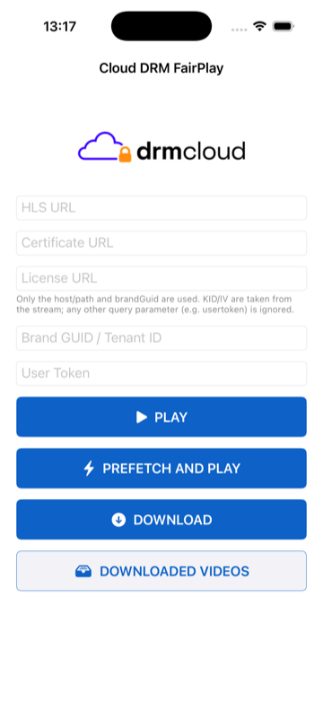

# AVPlayer with Cloud DRM in Swift

> [!IMPORTANT]
> This repository is an educational reference sample, not a production application or an application architecture template. Its code is deliberately direct and compact so that iOS developers can quickly find, read, and reuse the parts required to connect native `AVPlayer` playback and downloads to Cloud DRM. A production application may require additional layering, dependency injection, secure configuration management, analytics, recovery logic, and tests appropriate to its own requirements.

This sample demonstrates FairPlay Streaming (FPS) DRM playback for HLS with Apple's native `AVPlayer`. It also shows license prefetching, downloading FairPlay-protected HLS, storing a persistent content key, offline playback, and deleting downloaded content.

The functionality and simple test-screen layout are inspired by the ExoPlayer Android Samples, while the implementation is native to iOS and uses `AVFoundation`, `AVKit`, and SwiftUI. The project has no external dependencies.



## What This Sample Contains

The main screen accepts five values:

- **HLS URL** - URL of the HLS manifest (`.m3u8`).
- **Certificate URL** - Cloud DRM FairPlay application certificate endpoint.
- **License URL** - Cloud DRM license acquisition endpoint.
- **Brand GUID / Tenant ID** - tenant identifier used by Cloud DRM.
- **User Token** - token authorizing license acquisition.

It provides four actions:

- **PLAY** - starts playback and lets AVFoundation acquire the FairPlay key on demand.
- **PREFETCH AND PLAY** - acquires the key first and then opens a paused, ready player.
- **DOWNLOAD** - downloads the HLS asset and stores a persistent FairPlay key.
- **DOWNLOADED VIDEOS** - lists, plays, and deletes locally stored assets.

The application does not log in to Cloud Video Kit, retrieve assets or tenants from an API, or generate and inspect user tokens. All connection values are supplied explicitly so the Cloud DRM integration remains visible and easy to follow.

## Prerequisites

- Xcode 26 or a compatible newer version.
- iOS 17 or later.
- A physical iPhone or iPad for FairPlay playback and download testing. The user interface can run in the Simulator, but FairPlay Streaming cannot be validated there.
- Access to Cloud DRM and an FPS-protected HLS asset.
- A valid HLS URL, certificate URL, license URL, Brand GUID, and user token.

Connection values can be obtained through the [Cloud Video Kit web console](https://console.videokit.cloud/). See the [Cloud DRM token documentation](https://docs.videokit.cloud/developers/cloud-drm/license-acquisition/token) for the user-token format and signing requirements.

## How to Use

1. Open `CloudDrmFairPlaySample.xcodeproj` in Xcode.
2. Select the `CloudDrmFairPlaySample` scheme and a physical iOS device.
3. Set a valid Development Team if Xcode asks for signing configuration.
4. Build and run the application.
5. Enter the HLS, certificate, license, tenant, and token values.
6. Choose **PLAY**, **PREFETCH AND PLAY**, or **DOWNLOAD**.

The code excerpts below are shortened for readability. The linked source files contain the complete implementation used by the application.

The URL fields must contain valid `http://` or `https://` URLs. The Brand GUID must be a UUID, and the token cannot be empty. [`FairPlayConfiguration.swift`](CloudDrmFairPlaySample/Model/FairPlayConfiguration.swift) keeps this validation next to the values used by every playback and download path:

```swift
struct FairPlayConfiguration: Equatable, Sendable {
    let hlsURL: URL
    let certificateURL: URL
    let licenseURL: URL
    let brandGuid: String
    let userToken: String

    init(
        hlsURL: String,
        certificateURL: String,
        licenseURL: String,
        brandGuid: String,
        userToken: String
    ) throws {
        self.hlsURL = try Self.validHTTPURL(hlsURL, field: "HLS URL")
        self.certificateURL = try Self.validHTTPURL(certificateURL, field: "Certificate URL")
        self.licenseURL = try Self.validHTTPURL(licenseURL, field: "License URL")

        let trimmedBrandGuid = brandGuid.trimmingCharacters(in: .whitespacesAndNewlines)
        guard UUID(uuidString: trimmedBrandGuid) != nil else {
            throw SampleError.invalidBrandGuid
        }
        self.brandGuid = trimmedBrandGuid

        let trimmedToken = userToken.trimmingCharacters(in: .whitespacesAndNewlines)
        guard !trimmedToken.isEmpty else {
            throw SampleError.missingToken
        }
        self.userToken = trimmedToken
    }
}
```

## FairPlay Playback

### 1. Create the content-key session

[`FairPlaySession.swift`](CloudDrmFairPlaySample/DRM/FairPlaySession.swift) owns an `AVContentKeySession` configured for FairPlay Streaming. The asset is added as a content-key recipient, which causes AVFoundation to deliver its key requests to the session delegate.

```swift
final class FairPlaySession: NSObject, AVContentKeySessionDelegate {
    private let contentKeySession = AVContentKeySession(keySystem: .fairPlayStreaming)
    private var asset: AVURLAsset?

    init(configuration: FairPlayConfiguration) {
        self.configuration = configuration
        super.init()
        contentKeySession.setDelegate(self, queue: .global(qos: .userInitiated))
    }

    func makeStreamingPlayerItem() -> AVPlayerItem {
        let nextAsset = AVURLAsset(url: configuration.hlsURL)
        contentKeySession.addContentKeyRecipient(nextAsset)
        asset = nextAsset
        return AVPlayerItem(asset: nextAsset)
    }
}
```

The sample keeps `FairPlaySession` alive for as long as the player is displayed. `PlayerViewModel` creates an `AVPlayer` from the returned item and starts playback:

```swift
let session = FairPlaySession(configuration: configuration)
fairPlaySession = session

let item = session.makeStreamingPlayerItem()
let player = AVPlayer(playerItem: item)
self.player = player
player.play()
```

### 2. Handle the FairPlay key request

When encrypted HLS playback needs a key, AVFoundation calls `contentKeySession(_:didProvide:)`. The sample then performs the standard FairPlay exchange:

1. Read the `skd://` content-key identifier.
2. Download the FairPlay application certificate.
3. Ask AVFoundation to generate an SPC (Server Playback Context).
4. Send the SPC to Cloud DRM and receive a CKC (Content Key Context).
5. Return the CKC to AVFoundation as an `AVContentKeyResponse`.

```swift
func contentKeySession(
    _ session: AVContentKeySession,
    didProvide keyRequest: AVContentKeyRequest
) {
    Task {
        do {
            let identifier = try FairPlayConfiguration.contentIdentifier(
                from: keyRequest.identifier
            )
            let certificate = try await licenseClient.fetchCertificate(
                configuration: configuration
            )
            let spcData = try await makeSPC(
                for: keyRequest,
                certificate: certificate,
                contentIdentifier: identifier.data
            )
            let ckcData = try await licenseClient.acquireLicense(
                configuration: configuration,
                keyIdentifier: identifier.raw,
                spcData: spcData
            )

            keyRequest.processContentKeyResponse(
                AVContentKeyResponse(fairPlayStreamingKeyResponseData: ckcData)
            )
        } catch {
            keyRequest.processContentKeyResponseError(error)
        }
    }
}
```

The SPC is produced by the native FairPlay API. This sample requests FairPlay protocol version 1; it does not expose an SPC version selector.

```swift
keyRequest.makeStreamingContentKeyRequestData(
    forApp: certificate,
    contentIdentifier: contentIdentifier,
    options: [AVContentKeyRequestProtocolVersionsKey: [1]]
) { data, error in
    // Resume with SPC data or report the error to AVFoundation.
}
```

### 3. Request the certificate and license

[`FairPlayLicenseClient.swift`](CloudDrmFairPlaySample/DRM/FairPlayLicenseClient.swift) contains the two network operations needed by the DRM flow. Certificate acquisition is a GET request with the tenant and token in the query:

```swift
components.queryItems = (components.queryItems ?? []) + [
    URLQueryItem(name: "brandGuid", value: configuration.brandGuid),
    URLQueryItem(name: "usertoken", value: configuration.userToken)
]

let (data, response) = try await urlSession.data(from: url)
```

License acquisition sends the raw SPC body and Cloud DRM headers:

```swift
var request = URLRequest(url: licenseURL)
request.httpMethod = "POST"
request.httpBody = spcData
request.setValue("application/octet-stream", forHTTPHeaderField: "Content-Type")
request.setValue(configuration.brandGuid, forHTTPHeaderField: "x-drm-brandGuid")
request.setValue(configuration.userToken, forHTTPHeaderField: "x-drm-usertoken")

let (data, response) = try await urlSession.data(for: request)
```

The certificate may be returned as raw DER, base64, or PEM. The CKC may be returned as raw bytes or as `{ "ckc": "<base64>" }` JSON.

### 4. Build the license URL

The configured License URL provides the host and path. The app replaces its query with:

- `brandGuid` from the form;
- `KID` and `IV` copied from the HLS `skd://` key identifier.

The user token is sent in a request header and is never added to the license URL.

```swift
func licenseRequestURL(for keyIdentifier: String) -> URL {
    var components = URLComponents(
        url: licenseURL,
        resolvingAgainstBaseURL: false
    )!

    var queryItems = [URLQueryItem(name: "brandGuid", value: brandGuid)]
    if let keyComponents = URLComponents(string: keyIdentifier) {
        for item in keyComponents.queryItems ?? []
            where ["kid", "iv"].contains(item.name.lowercased()) {
            queryItems.append(item)
        }
    }

    components.queryItems = queryItems
    return components.url ?? licenseURL
}
```

## License Prefetching

**PLAY** relies on normal, lazy AVFoundation key acquisition. **PREFETCH AND PLAY** demonstrates how to acquire the license before the user starts playback.

[`HLSKeyURIResolver.swift`](CloudDrmFairPlaySample/DRM/HLSKeyURIResolver.swift) first reads the HLS playlist and resolves the first `skd://` URI. If the supplied URL is a master playlist, it follows the first variant playlist. The session then explicitly starts a content-key request and waits until the delegate has processed the CKC:

```swift
let keyURI = try await resolver.fairPlayKeyURI(from: configuration.hlsURL)
let certificate = try await licenseClient.fetchCertificate(configuration: configuration)

let nextAsset = AVURLAsset(url: configuration.hlsURL)
contentKeySession.addContentKeyRecipient(nextAsset)
asset = nextAsset
prefetchedCertificate = certificate

try await withCheckedThrowingContinuation { continuation in
    prefetchContinuation = continuation
    contentKeySession.processContentKeyRequest(
        withIdentifier: keyURI,
        initializationData: nil,
        options: nil
    )
}

return AVPlayerItem(asset: nextAsset)
```

The player opens paused and displays **Ready** after the key exchange succeeds. Diagnostic messages are written with `OSLog`; there is intentionally no request-history or HTTP-diagnostics screen in the app.

## Download and Offline Playback

### Persistent-license token

Online playback and offline download use user tokens supplied by the developer. The app does not create, decode, alter, or persist them.

For a download, Cloud DRM must be allowed to issue a persistent FairPlay license. A token payload can include the following FairPlay persistence claims:

```json
{
  "exp": 1893456000,
  "kid": ["*"],
  "fairplay": {
    "persistent": true,
    "offline_storage_duration": 86400
  }
}
```

The exact token structure and signing rules are defined by the [Cloud DRM token documentation](https://docs.videokit.cloud/developers/cloud-drm/license-acquisition/token).

### Download the HLS package

[`FairPlayDownloadManager.swift`](CloudDrmFairPlaySample/Downloads/FairPlayDownloadManager.swift) uses `AVAssetDownloadURLSession`, the native API for downloading HLS assets. The asset is also registered with an `AVContentKeySession` so the download can obtain its key.

```swift
let asset = AVURLAsset(url: configuration.hlsURL)
let keySession = AVContentKeySession(keySystem: .fairPlayStreaming)
keySession.setDelegate(self, queue: .global(qos: .userInitiated))
keySession.addContentKeyRecipient(asset)

let task = downloadSession.makeAssetDownloadTask(
    asset: asset,
    assetTitle: displayName,
    assetArtworkData: nil,
    options: nil
)
task?.resume()
```

The sample supports one active download at a time. The button changes to **CANCEL** while the task is running, and incomplete package and key files are removed after cancellation or failure.

### Create and store a persistent key

A normal `AVContentKeyRequest` is upgraded to an `AVPersistableContentKeyRequest`:

```swift
func contentKeySession(
    _ session: AVContentKeySession,
    didProvide keyRequest: AVContentKeyRequest
) {
    do {
        try keyRequest.respondByRequestingPersistableContentKeyRequestAndReturnError()
    } catch {
        keyRequest.processContentKeyResponseError(error)
    }
}
```

After the certificate, SPC, and CKC exchange, the CKC is converted into a persistable key and stored locally:

```swift
let persistentKey = try keyRequest.persistableContentKey(
    fromKeyVendorResponse: ckcData,
    options: nil
)
try persistentKey.write(to: keyURL, options: .atomic)

keyRequest.processContentKeyResponse(
    AVContentKeyResponse(fairPlayStreamingKeyResponseData: persistentKey)
)
```

The download is added to **DOWNLOADED VIDEOS** only after both the HLS package and persistent key are available.

### Play without network access

[`OfflineFairPlaySession.swift`](CloudDrmFairPlaySample/Downloads/OfflineFairPlaySession.swift) registers the local HLS package with a new content-key session. Instead of contacting the certificate and license endpoints, it returns the stored persistent key:

```swift
func contentKeySession(
    _ session: AVContentKeySession,
    didProvide keyRequest: AVPersistableContentKeyRequest
) {
    keyRequest.processContentKeyResponse(
        AVContentKeyResponse(
            fairPlayStreamingKeyResponseData: persistentKeyData
        )
    )
}
```

Deleting an item removes the downloaded HLS package, persistent key, and metadata record.

## Cloud DRM HTTP Contract

Certificate request:

```http
GET <certificateURL>?brandGuid=<brandGuid>&usertoken=<userToken>
```

License request:

```http
POST <licenseURL>?brandGuid=<brandGuid>&KID=<kid>&IV=<iv>
Content-Type: application/octet-stream
x-drm-brandGuid: <brandGuid>
x-drm-usertoken: <userToken>

<raw SPC bytes>
```

## Project Structure

The source is split only by responsibility, keeping the DRM path short enough to follow from the screen to AVFoundation and Cloud DRM:

```text
CloudDrmFairPlaySample/
  App/CloudDrmFairPlaySampleApp.swift
  Views/ContentView.swift
  Views/PlayerView.swift
  Views/DownloadedVideosView.swift
  Model/FairPlayConfiguration.swift
  DRM/FairPlaySession.swift
  DRM/FairPlayLicenseClient.swift
  DRM/HLSKeyURIResolver.swift
  Downloads/FairPlayDownloadManager.swift
  Downloads/OfflineFairPlaySession.swift
  Downloads/DownloadedAsset.swift
```

There are no repository, use-case, service-locator, or dependency-injection layers. This is intentional for this reference sample. The application is designed to explain the integration sequence, not prescribe the architecture of a client application.

## Storage and Logging

Completed download metadata is stored in:

```text
Application Support/CloudDrmFairPlaySample/downloaded-assets.json
```

Persistent keys are stored in:

```text
Application Support/CloudDrmFairPlaySample/FairPlayKeys/
```

The user token, SPC, and CKC are not written to disk. Basic lifecycle and error messages are emitted to the Xcode console through `OSLog`, using subsystem `com.insys.CloudDrmFairPlaySample`. The sample does not include an in-app log panel, request history, request comparison, SPC decoding, or advanced HTTP diagnostics.

## Known Limitations

- FairPlay playback and persistent-key behavior must be tested on a physical iOS device.
- The prefetch playlist resolver follows the first HLS variant and searches up to four playlist levels.
- The reference download flow handles one active download at a time.
- Each downloaded record stores one FairPlay key identifier.
- Restoring an unfinished download after the application is force-quit is outside this sample's scope because the user token is deliberately not persisted.
- Production concerns such as credential storage, certificate pinning, telemetry, background-session restoration policy, and application-specific architecture are left to the integrating application.

## Troubleshooting

- **No FairPlay key URI** - verify that the master or media playlist contains `#EXT-X-KEY` or `#EXT-X-SESSION-KEY` with a `URI="skd://..."` value.
- **Certificate request failed** - check the Certificate URL, Brand GUID, token, and HTTP response status.
- **License request failed** - check the License URL, token expiry, allowed KIDs, and Brand GUID.
- **Persistent key creation failed** - use a token that permits persistent FairPlay licenses.
- **Playback fails in the Simulator** - deploy to a physical iPhone or iPad.
- **More detail is needed** - open the Xcode console and filter by `com.insys.CloudDrmFairPlaySample`.

## Acknowledgements

- [AVFoundation and FairPlay Streaming](https://developer.apple.com/streaming/fps/) - Apple's native playback and DRM technologies for HLS.
- [Cloud DRM documentation](https://docs.videokit.cloud/developers/cloud-drm) - Cloud DRM integration documentation.
